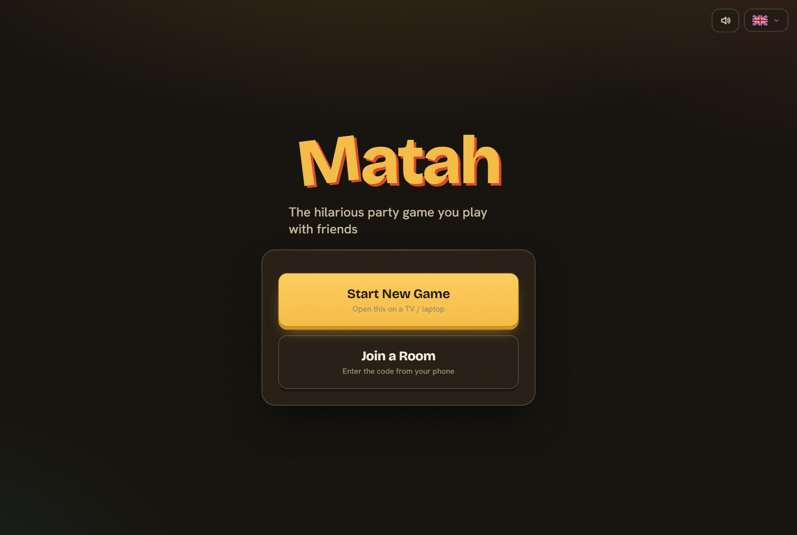
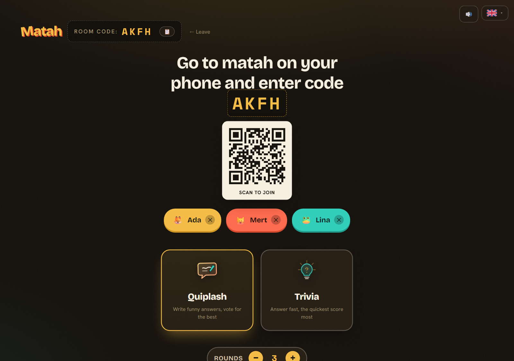
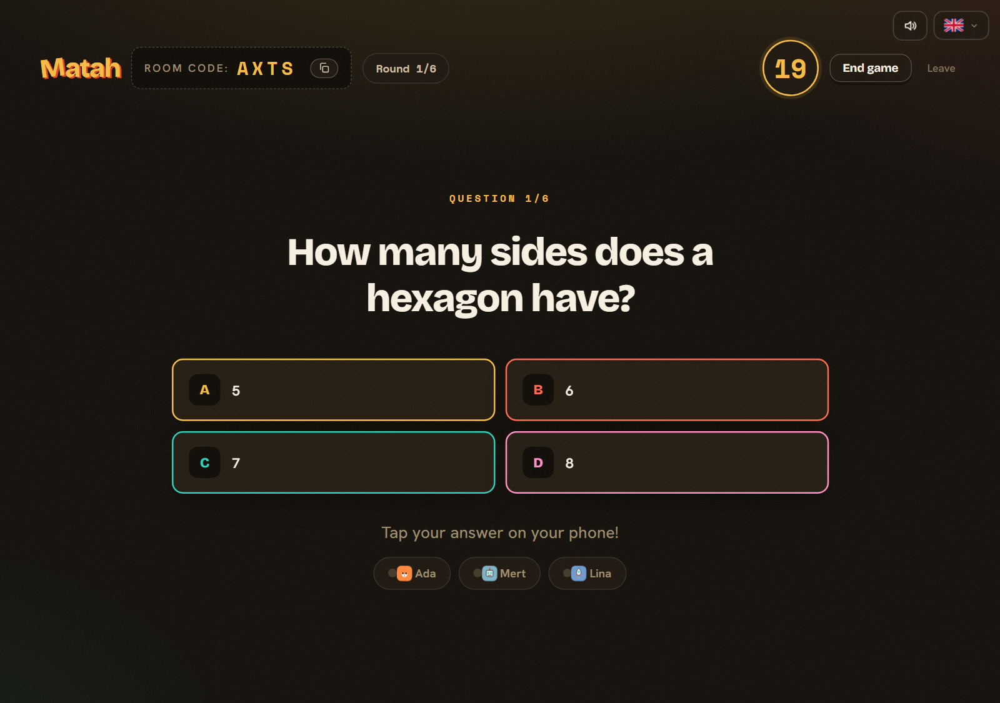
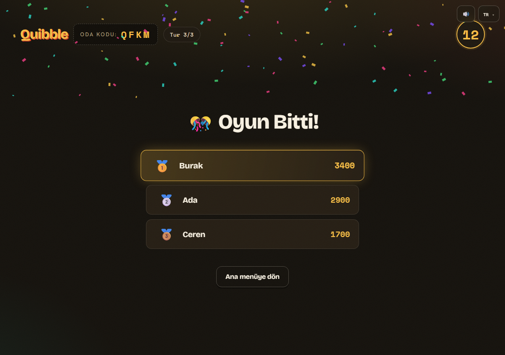

<div align="center">

# 🎉 Quibble

### Das lustige Partyspiel für Freunde

*Öffne den Host-Bildschirm auf dem TV, schnappt euch die Handys, und das Chaos beginnt.*

[English](README.md) · [Türkçe](README.tr.md) · **Deutsch** · [Español](README.es.md)

<br/>

[](https://quibble-0rjn.onrender.com)


<br/>






</div>

---

## 🎮 Was ist Quibble?

Quibble ist ein **Partyspiel im Jackbox-Stil, in Echtzeit und für mehrere
Spieler**. Ein Bildschirm — ein TV oder Laptop — dient als **Host-Anzeige** und
zeigt einen 4-stelligen Raumcode. Alle anderen **treten per Handy bei**, und das
Spiel läuft auf allen Geräten gleichzeitig.

Es kommt mit **zwei Spielmodi**, und die Engine ist so gebaut, dass weitere leicht hinzukommen:

| Modus | So funktioniert es |
|-------|--------------------|
| ✍️ **Quiplash** | Alle erhalten eine lustige Frage, schreiben die witzigste Antwort, dann stimmt der Raum im Duell ab. Die meisten Stimmen gewinnen die Runde. |
| 🧠 **Quiz** | Multiple-Choice-Fragen: **richtig und schnell** antworten bringt am meisten — mit Bonus für Antwort-**Serien**. |

> **▶ Jetzt ausprobieren:** **<https://quibble-0rjn.onrender.com>**
> *(Auf einem kostenlosen Tier gehostet — die erste Anfrage nach einer Pause kann ~50 Sek. zum Aufwachen brauchen.)*

---

## ✨ Highlights

- ⚡ **Echtzeit-Multiplayer** über Socket.IO, mit automatischem Reconnect
- 🎲 **Multi-Game-Plattform** — eine saubere, erweiterbare `GameEngine`-Architektur
- 🌍 **4 Sprachen** — Türkçe, English, Deutsch, Español (Oberfläche *und* Frageninhalt)
- 🔊 **Soundeffekte**, synthetisiert mit der Web Audio API (keine Audiodateien)
- 🎬 **Animierte Übergänge** + ein Canvas-Konfetti-Finale
- 🔒 **Sicherheitsbewusst** — Helmet/CSP, Eingabevalidierung, Rate-Limiting pro Socket
- 🚀 **Performanceorientiert** — gzip, Vendor-Chunk-Splitting, selbst gehostete Schriften

---

## 🕹️ So wird gespielt

1. Auf einem **TV oder Laptop** die App öffnen und **Neues Spiel starten** → ein Raumcode erscheint.
2. Auf jedem **Handy** (gleiches WLAN oder einfach die Live-URL) auf **Raum beitreten** tippen, Name + Code eingeben.
3. Sobald **mindestens 3 Spieler** beigetreten sind, wählt der Host einen Modus und startet.
4. Antworten, abstimmen, den Punkten beim Steigen zusehen — und Konfetti für den Gewinner! 🎊

---

## 🛠️ Tech-Stack

Ein TypeScript-Monorepo (npm workspaces) mit drei Paketen:

```
quibble/
├─ shared/   → von beiden Seiten geteilte Typen & Socket.IO-Event-Verträge
├─ server/   → Express + Socket.IO Spielserver (Räume im Speicher + Engines)
└─ client/   → React + Vite Oberfläche (Host-Anzeige + Spieler-Controller)
```

**Server:** Node · Express · Socket.IO  ·  **Client:** React · Vite  ·  **Shared:** durchgehend typisierte Events

---

## 🚀 Loslegen

```bash
npm install      # alle Workspaces installieren
npm run dev      # Server auf :3001, Client auf :5173
```

Zum Hosten `http://localhost:5173` am Computer öffnen, zum Beitreten die im
Terminal angezeigte LAN-Adresse auf den Handys.

### Nützliche Skripte

| Befehl | Wirkung |
|--------|---------|
| `npm run dev` | Server + Client im Watch-Modus |
| `npm run build` | Produktions-Client-Bundle bauen |
| `npm start` | Produktionsserver (liefert auch den gebauten Client) |
| `npm run typecheck` | Jeden Workspace typprüfen |
| `npm run test:e2e` | Beide Modi end-to-end durchspielen |

---

## ☁️ Deployment

Die ganze App wird als ein einziger Service deployt — in Produktion liefert der
Node-Server den gebauten Client vom selben Origin.

- **Render (kostenlos, ein Klick):** zu GitHub pushen, dann **New → Blueprint** und das Repo wählen. `render.yaml` erledigt den Rest.
- **Docker:** `docker build -t quibble . && docker run -p 3001:3001 quibble`
- **Manuell:** `npm install && npm run build && NODE_ENV=production npm start`

---

## 📁 Projektstruktur

```
quibble/
├─ shared/src/index.ts        # geteilte Typen + Socket-Verträge
├─ server/src/
│  ├─ index.ts                # Socket.IO-Server, Sicherheit, Prod-Static-Serving
│  ├─ room.ts                 # Raum: Mitglieder, Phasen-/Timer-Maschine, Punkte
│  ├─ engine.ts               # GameEngine-Interface
│  ├─ engines/                # quiplash.ts · trivia.ts
│  ├─ content/                # prompts.ts · trivia.ts (Inhalt in 4 Sprachen)
│  └─ rateLimiter.ts          # Token-Bucket pro Socket
└─ client/src/
   ├─ views/                  # Home · HostScreen · PlayerScreen
   ├─ components/             # Controls (Sprache/Ton) · Confetti
   ├─ i18n/                   # Übersetzungen + Provider
   └─ sound.ts                # synthetisierte Soundeffekte
```

---

<div align="center">

Mit ❤️ und TypeScript gebaut · Lizenziert unter [MIT](LICENSE)

</div>
