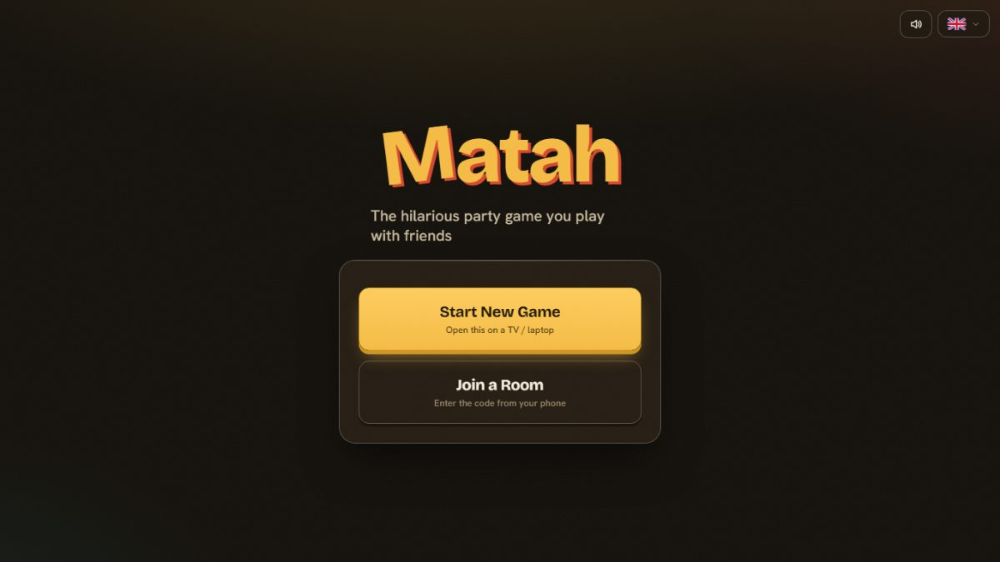
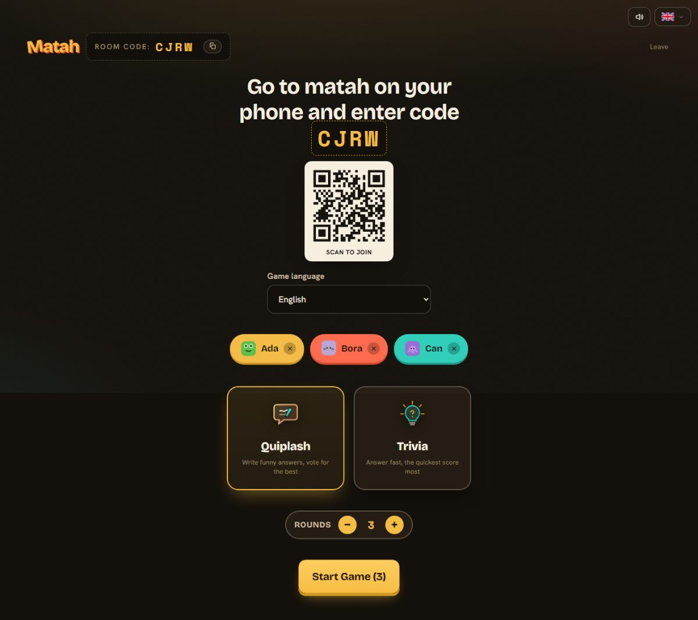
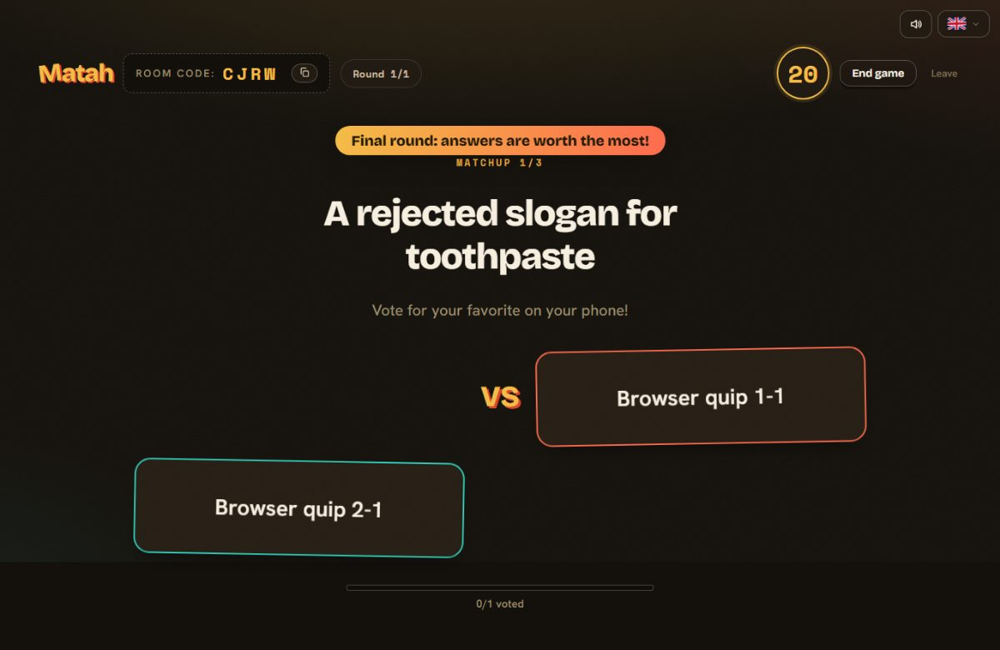
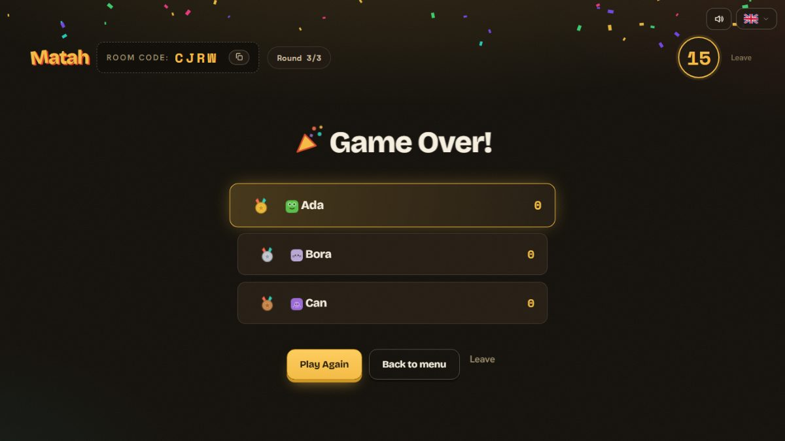

<a id="top"></a>
# Matah

The party game you play with friends: one TV, everyone's phones, three game modes, 14 languages.

[](https://github.com/IACBI/matah/actions/workflows/ci.yml)


<p align="center">
  
  
  
  
</p>

**Read this in:** [English](#english) · [Türkçe](#turkce)

---

<a id="english"></a>
## English

### Overview

Matah is a Jackbox-style party game played in real time. A TV or laptop runs
the host screen and shows a four-letter room code; everyone else joins from
their phone and the game plays out on every device at once. The server decides
everything that matters (who is in the room, the timers, the scores), so a
phone that drops and comes back picks up exactly where it was.

| Mode | How it plays |
|------|--------------|
| **Quiplash** | Everyone writes the funniest answer to a prompt, then the room votes head to head. Later rounds are worth more. |
| **Trivia** | Multiple choice. Being right and being fast both score, with a bonus for streaks and double points on the last question. |
| **Bluff** | Write a believable fake answer to a trivia question, then find the real one among everyone's lies. You score for finding the truth and for every player your lie fools. |

### Features

- Three game modes, each available in all 14 languages: 40 Quiplash prompts and 32 trivia questions per language.
- Dropped connections recover their seat, their vote and a half-written answer through a private, single-use resume token.
- Games survive a server restart when a snapshot store is configured. Rooms are saved on shutdown and every few seconds, so a deploy or a crash costs at most the last moments of play.
- Host tools: pause and resume, skip ahead, end early, set the game length, remove a player, and move players between seats and the audience.
- Custom content packs: the host pastes up to 30 Quiplash prompts, or up to 12 trivia questions for Trivia and Bluff, and they are played before the built-in ones. A question is one line, `question | right answer | wrong | wrong | wrong`, and a row copied from a spreadsheet works as it is.
- Latecomers and anyone joining a full room watch as the audience and still vote in Quiplash.
- The scoreboard shows the game's best moments and running session standings, and a share button sends a text recap to the phone's share sheet or the clipboard.
- Quiplash results show who voted for which answer. Emoji reactions fly across the host screen.
- Rate limits, connection and room ceilings, origin checks, Helmet/CSP, and sanitized input throughout. See [SECURITY.md](SECURITY.md).

### Requirements

- Node.js 24.15 or newer on the 24 line, or 26 and up. The test runner does not support the 25 line.
- npm 11.
- Optional: a Redis server, only if you want games to survive restarts on a host without a persistent disk.

### Installation

```bash
npm ci
npm run dev
```

The server listens on port 3001 and the client on 5173. Open
`http://localhost:5173` to host, and the LAN address printed in the terminal on
each phone to join.

To deploy, one Node service serves both the Socket.IO server and the built
client:

- **Render:** choose **New → Blueprint** and select the repository. `render.yaml` builds both workspaces and asks for `PUBLIC_ORIGIN`.
- **Docker:** `docker build -t matah . && docker run --rm -p 3001:3001 -e PUBLIC_ORIGIN=http://localhost:3001 matah`
- **Any Node host:** `npm ci`, `npm run build`, then `NODE_ENV=production PUBLIC_ORIGIN=https://your-domain.example npm start`.

### Usage

1. On the TV or laptop, press **Start New Game**. A room code and a QR code appear.
2. On each phone, scan the QR code, or open the site, press **Join a Room**, and enter a name and the code.
3. With at least three players in, the host picks a mode and a length and starts.

| Command | What it does |
|---------|--------------|
| `npm run dev` | Server and client in watch mode |
| `npm run build` | Compile the server and build the production client |
| `npm start` | Run the compiled production server |
| `npm test` | Server unit and integration suites plus client component tests |
| `npm run test:coverage:server` | Enforce 93% line / 80% branch coverage on the server |
| `npm run test:coverage:client` | Enforce 62% line / 70% branch coverage on the client |
| `npm run test:smoke` | Multiplayer smoke suite against the compiled server |
| `npm run test:browser` | Real Chromium: multiplayer, pause, Bluff, responsive, RTL and axe checks |
| `npm run test:load` | 60-second, 25-room bounded load and leak check |
| `npm run lint` · `npm run typecheck` | ESLint and TypeScript across every workspace |

`test:smoke` and `test:browser` need `npm run build` first. `test:browser`
also needs Chromium: `npx playwright install chromium`.

### Configuration

| Variable | Required | Purpose |
|----------|----------|---------|
| `PUBLIC_ORIGIN` | In production | The exact public origin allowed to connect, for example `https://game.example.com`. No wildcards. |
| `NODE_ENV` | In production | `production` turns on static serving and the production origin check. |
| `ALLOWED_ORIGINS` | No | Extra exact origins, comma-separated, for staging domains. |
| `PORT` | No | HTTP port, default `3001`. |
| `MATAH_REDIS_URL` | No | `redis://` or `rediss://` URL. Rooms are snapshotted here so games survive a restart. Treat it as a secret. |
| `MATAH_SNAPSHOT_FILE` | No | A file path for the same snapshots, for hosts with a persistent disk. `MATAH_REDIS_URL` wins if both are set. |
| `MATAH_SNAPSHOT_KEY` | No | Redis key for the snapshot, default `matah:snapshot`. |
| `MATAH_SNAPSHOT_INTERVAL_MS` | No | How often a changed registry is saved, default `15000`, minimum `1000`. |
| `MATAH_TRUST_PROXY_HOPS` | No | How many proxies sit between the internet and the server, default `1`. Use `0` when clients connect directly, so a forged `X-Forwarded-For` is ignored. The per-address limits depend on it; see [SECURITY.md](SECURITY.md#deployment-guidance). |
| `MATAH_STATS_TOKEN` | No | At least 24 characters. Turns on `GET /stats` (counts and memory only, no room, player or address) for a caller sending `Authorization: Bearer <token>`. Treat it as a secret. |

Eleven `MATAH_RL_*` variables tune the rate limits and the connection and room
ceilings. The defaults are sized for a whole household behind one address; the
full list and the reasoning behind each default are in
[docs/ARCHITECTURE.md](docs/ARCHITECTURE.md#rate-limiting).

Run exactly one instance. Rooms live in that process's memory, and two
instances would neither share rooms nor share a snapshot key safely. Render's
free plan and most containers lose their disk on redeploy, so use Redis there
rather than a snapshot file. Restart persistence is tested against Redis 7;
a Redis-compatible service that accepts `AUTH`, `SELECT`, `GET` and `SET` should
work the same way. How snapshots, timers and resume tokens survive a restart is
described in [docs/ARCHITECTURE.md](docs/ARCHITECTURE.md#surviving-a-restart).

### Contributing

Issues and pull requests are welcome. [CONTRIBUTING.md](CONTRIBUTING.md) covers
the workflow and the checks to run first, and [CHANGELOG.md](CHANGELOG.md)
records what changed. The Redis tests skip themselves unless
`MATAH_TEST_REDIS_URL` points at a disposable Redis.

The repository is an npm workspace with three packages: `shared/` holds the
types and Socket.IO event contracts, `server/` holds the Express and Socket.IO
server with one engine per game mode, and `client/` holds the React host and
phone interface.

### License

MIT © 𝓐.𝓒.𝓑. See [LICENSE](LICENSE).

[⬆ Back to top](#top)

---

<a id="turkce"></a>
## Türkçe

### Genel Bakış

Matah, gerçek zamanlı oynanan Jackbox tarzı bir parti oyunu. TV ya da laptop
host ekranını açar ve dört harfli bir oda kodu gösterir; diğer herkes
telefonundan katılır ve oyun bütün cihazlarda aynı anda akar. Önemli olan her
şeye (odada kimin olduğuna, sürelere, puanlara) sunucu karar verir. Bu yüzden
bağlantısı kopan bir telefon geri döndüğünde tam kaldığı yerden devam eder.

| Mod | Nasıl oynanır |
|-----|---------------|
| **Quiplash** | Herkes bir soruya en komik cevabı yazar, sonra oda ikili düellolarda oylar. Sonraki turlar daha çok puan getirir. |
| **Bilgi Yarışması** | Çoktan seçmeli. Hem doğru hem hızlı cevap puan kazandırır; üst üste doğrulara seri bonusu, son soruya çift puan vardır. |
| **Blöf** | Bir bilgi sorusuna inandırıcı bir sahte cevap yaz, sonra herkesin yalanları arasından gerçeğini bul. Gerçeği bulmak da, yalanınla kandırdığın her oyuncu da puan getirir. |

### Özellikler

- Üç oyun modu, 14 dilin hepsinde: her dilde 40 Quiplash sorusu ve 32 bilgi sorusu.
- Bağlantısı kopan oyuncu, kişiye özel ve tek kullanımlık bir devam anahtarıyla koltuğunu, oyunu ve yarım kalan cevabını geri alır.
- Bir kayıt deposu ayarlandığında oyunlar sunucunun yeniden başlamasından sağ çıkar. Odalar kapanışta ve birkaç saniyede bir kaydedilir; bir deploy ya da çökme en fazla son birkaç anı kaybettirir.
- Host araçları: duraklatma ve devam ettirme, sonraki aşamaya geçme, oyunu erken bitirme, oyun uzunluğunu ayarlama, oyuncu çıkarma ve oyuncuları koltuk ile izleyiciler arasında taşıma.
- Özel içerik paketleri: host en fazla 30 Quiplash sorusu ya da Bilgi Yarışması ve Blöf için en fazla 12 bilgi sorusu yapıştırır; bunlar hazır sorulardan önce oynanır. Bir bilgi sorusu tek satırdır: `soru | doğru cevap | yanlış | yanlış | yanlış`. Tablodan kopyalanan bir satır olduğu gibi çalışır.
- Geç gelenler ve dolu odaya katılanlar izleyici olarak oyunu takip eder, Quiplash'te yine oy kullanır.
- Skor tablosu oyunun en iyi anlarını ve oturum boyunca biriken sıralamayı gösterir; paylaş butonu kısa bir özeti telefonun paylaşım menüsüne ya da panoya gönderir.
- Quiplash sonuçları kimin hangi cevaba oy verdiğini gösterir. Emoji tepkileri host ekranında uçuşur.
- Hız sınırları, bağlantı ve oda tavanları, origin kontrolü, Helmet/CSP ve her yerde temizlenmiş girdi. Ayrıntılar [SECURITY.md](SECURITY.md) içinde.

### Gereksinimler

- Node.js 24 serisinde 24.15 ya da üstü, veya 26 ve sonrası. Test çalıştırıcısı 25 serisini desteklemiyor.
- npm 11.
- İsteğe bağlı: bir Redis sunucusu. Yalnızca kalıcı diski olmayan bir sunucuda oyunların yeniden başlatmaya dayanmasını istiyorsan gerekir.

### Kurulum

```bash
npm ci
npm run dev
```

Sunucu 3001, istemci 5173 portunu dinler. Host olmak için
`http://localhost:5173` adresini, katılmak için de terminalde yazan yerel ağ
adresini her telefonda aç.

Yayına alırken tek bir Node servisi hem Socket.IO sunucusunu hem de derlenmiş
istemciyi sunar:

- **Render:** **New → Blueprint** seçip depoyu işaretle. `render.yaml` iki workspace'i de derler ve `PUBLIC_ORIGIN` değerini sorar.
- **Docker:** `docker build -t matah . && docker run --rm -p 3001:3001 -e PUBLIC_ORIGIN=http://localhost:3001 matah`
- **Herhangi bir Node sunucusu:** `npm ci`, `npm run build`, ardından `NODE_ENV=production PUBLIC_ORIGIN=https://your-domain.example npm start`.

### Kullanım

1. TV'de ya da laptopta **Yeni Oyun Başlat**'a bas. Bir oda kodu ve QR kod çıkar.
2. Her telefonda QR kodu okut, ya da siteyi açıp **Odaya Katıl**'a bas, bir isim ve kodu gir.
3. En az üç oyuncu gelince host modu ve uzunluğu seçip oyunu başlatır.

| Komut | Ne yapar |
|-------|----------|
| `npm run dev` | Sunucu ve istemciyi izleme modunda çalıştırır |
| `npm run build` | Sunucuyu derler, üretim istemcisini oluşturur |
| `npm start` | Derlenmiş üretim sunucusunu çalıştırır |
| `npm test` | Sunucu unit ve entegrasyon testleri ile istemci bileşen testleri |
| `npm run test:coverage:server` | Sunucuda %93 satır / %80 dal kapsamını zorunlu tutar |
| `npm run test:coverage:client` | İstemcide %62 satır / %70 dal kapsamını zorunlu tutar |
| `npm run test:smoke` | Derlenmiş sunucuya karşı çok oyunculu smoke testleri |
| `npm run test:browser` | Gerçek Chromium'da çok oyunculu, duraklatma, Blöf, duyarlı tasarım, RTL ve axe kontrolleri |
| `npm run test:load` | 60 saniyelik, 25 odalık sınırlı yük ve sızıntı testi |
| `npm run lint` · `npm run typecheck` | Tüm workspace'lerde ESLint ve TypeScript |

`test:smoke` ve `test:browser` önce `npm run build` ister. `test:browser` için
Chromium da gerekir: `npx playwright install chromium`.

### Yapılandırma

| Değişken | Zorunlu | Amacı |
|----------|---------|-------|
| `PUBLIC_ORIGIN` | Üretimde | Bağlanmasına izin verilen tam genel origin, örneğin `https://game.example.com`. Joker karakter kullanılmaz. |
| `NODE_ENV` | Üretimde | `production`, statik dosya sunmayı ve üretim origin kontrolünü açar. |
| `ALLOWED_ORIGINS` | Hayır | Staging alan adları için virgülle ayrılmış ek tam origin'ler. |
| `PORT` | Hayır | HTTP portu, varsayılan `3001`. |
| `MATAH_REDIS_URL` | Hayır | `redis://` ya da `rediss://` adresi. Odaların kaydı buraya alınır, böylece oyunlar yeniden başlatmadan sağ çıkar. Bir sır gibi sakla. |
| `MATAH_SNAPSHOT_FILE` | Hayır | Aynı kayıtlar için bir dosya yolu; kalıcı diski olan sunucular içindir. İkisi de ayarlıysa `MATAH_REDIS_URL` kullanılır. |
| `MATAH_SNAPSHOT_KEY` | Hayır | Kaydın Redis anahtarı, varsayılan `matah:snapshot`. |
| `MATAH_SNAPSHOT_INTERVAL_MS` | Hayır | Değişen odaların ne sıklıkla kaydedileceği, varsayılan `15000`, en az `1000`. |
| `MATAH_TRUST_PROXY_HOPS` | Hayır | İnternet ile sunucu arasında kaç proxy olduğu, varsayılan `1`. İstemciler doğrudan bağlanıyorsa `0` kullan; böylece sahte bir `X-Forwarded-For` yok sayılır. Adres başına sınırlar buna dayanır; bkz. [SECURITY.md](SECURITY.md#deployment-guidance). |
| `MATAH_STATS_TOKEN` | Hayır | En az 24 karakter. `Authorization: Bearer <token>` gönderen çağıranlar için `GET /stats` ucunu açar (yalnızca sayılar ve bellek; oda, oyuncu ya da adres yok). Bir sır gibi sakla. |

On bir `MATAH_RL_*` değişkeni hız sınırlarını, bağlantı ve oda tavanlarını
ayarlar. Varsayılanlar tek bir adresin arkasındaki bütün bir ev için
hesaplanmıştır; tam liste ve her varsayılanın gerekçesi
[docs/ARCHITECTURE.md](docs/ARCHITECTURE.md#rate-limiting) içinde.

Tam olarak bir instance çalıştır. Odalar o sürecin belleğinde yaşar; iki
instance ne odaları paylaşır ne de aynı kayıt anahtarını güvenle kullanabilir.
Render'ın ücretsiz planı ve çoğu konteyner deploy sırasında diskini kaybeder,
bu yüzden orada kayıt dosyası yerine Redis kullan. Yeniden başlatma kalıcılığı
Redis 7'ye karşı test edildi; `AUTH`, `SELECT`, `GET` ve `SET` komutlarını kabul
eden Redis uyumlu bir servis de aynı şekilde çalışmalı. Kayıtların, sürelerin
ve devam anahtarlarının yeniden başlatmadan nasıl sağ çıktığı
[docs/ARCHITECTURE.md](docs/ARCHITECTURE.md#surviving-a-restart) içinde anlatılıyor.

### Katkı

Issue ve pull request'lere açığız. Çalışma akışı ve önce çalıştırılacak
kontroller [CONTRIBUTING.md](CONTRIBUTING.md) içinde, değişikliklerin kaydı
[CHANGELOG.md](CHANGELOG.md) içinde. Redis testleri, `MATAH_TEST_REDIS_URL`
tek kullanımlık bir Redis'i göstermedikçe kendini atlar.

Depo üç paketten oluşan bir npm workspace: `shared/` tipleri ve Socket.IO olay
sözleşmelerini, `server/` her oyun modu için bir motorla birlikte Express ve
Socket.IO sunucusunu, `client/` ise React ile yazılmış host ve telefon
arayüzünü tutar.

### Lisans

MIT © 𝓐.𝓒.𝓑. Ayrıntılar [LICENSE](LICENSE) dosyasında.

[⬆ Başa Dön](#top)
